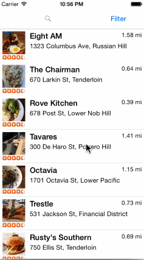

# Yelp Client

A client allowing searching/filtering Yelp's business listings, with a focus on restaurants.

Time spent: 18 hours

Mandatory features completed:

* YES: All table cells across both screens use auto-layout for all components, and all rows have auto-determined heights.
* YES: Search bar is in the navigation bar.
* YES: User sees "loading..." feedback anytime a network wait is ongoing.

Regarding the filter screen:
* I found a way to visually compress the list of categories - by avoiding use of the native "fat switch" and instead using the native checkmark-based multiple-selection feature of tables - and as a result, I found that even on small phones, an interface in which the list of categories scrolled "on its own" worked quite well.  I felt this was a nicer interface in that at all times the complete set of filter sections was represented on-screen.

