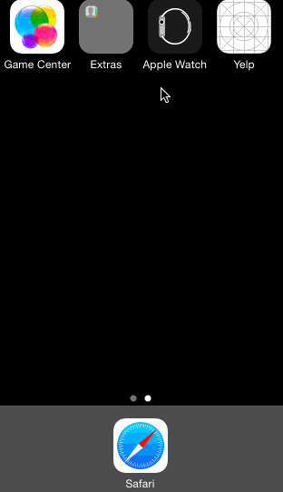

## Yelp

This is a Yelp search app using the [Yelp API](http://developer.rottentomatoes.com/docs/read/JSON).

Time spent: 6 hours

### Features

#### Required

- [x] Search results page
   - [x] Table rows should be dynamic height according to the content height
   - [x] Custom cells should have the proper Auto Layout constraints
   - [x] Search bar should be in the navigation bar (doesn't have to expand to show location like the real Yelp app does).
- [x] Filter page. Unfortunately, not all the filters are supported in the Yelp API.
   - [x] The filters you should actually have are: category, sort (best match, distance, highest rated), radius (meters), deals (on/off).
   - [x] The filters table should be organized into sections as in the mock.
   - [x] You can use the default UISwitch for on/off states. Optional: implement a custom switch
   - [x] Clicking on the "Search" button should dismiss the filters page and trigger the search w/ the new filter settings.
   - [x] Display some of the available Yelp categories (choose any 3-4 that you want).

### Walkthrough

